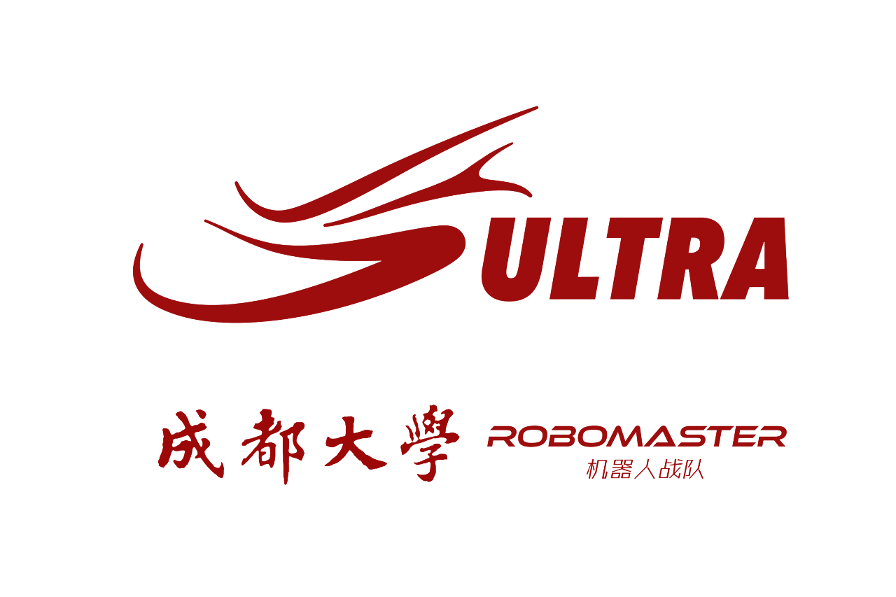

<h1 align="center">
  <a href="https://rmultra.cn/"></a>
  <br/>
  <a href="https://rmultra.cn/">成都大学 Ultra 战队 2025 赛季单目雷达站数据集</a>
</h1>

---

## 📖 数据集概述

本数据集包含成都大学 Ultra 战队在 **2025 超级对抗赛** 比赛期间采集的**单目雷达站**原始视频数据，包含多场正式比赛和训练赛，雷达站采用的是[厦门理工学院PFA战队单目方案](https://github.com/CarryzhangZKY/pfa_vision_radar)。

<div align="center">
  
</div>

## 📥 下载

> [!NOTE]
> 
> 下载地址：[⚡Github Releases](https://github.com/NGC2237plus/Ultra-Radar-Dataset-2025/releases)


## 🗂️ 数据集结构

```sh
SAVE_VIDEO\5-21-GAME1-1
└─raw
        screen_20250521_085434.mp4 # 完整单局比赛视频
        screen_20250521_085434.png # 视频第100帧截图（标定用）
```

文件命名是根据时间戳命名的，`.mp4` 是一局比赛的完整视频，对应的`.png` 图片是从视频中提取的（第100帧），与视频文件同名，仅扩展名不同，用于标定。

## 📊 数据集信息

|    属性    |         说明          |
| :--------: | :-------------------: |
|  采集时间  |  2025年5月20日-24日   |
|  采集场景  |   RMUC正式比赛场地    |
| 视频分辨率 |       1300*900        |
|    帧率    |        10 FPS         |
| 标定帧位置 | 所有视频统一取第100帧 |

> [!warning] 
> 
> 视频录制时固定10帧，视频时间戳**仅表示录制开始时刻**
> 
> 同时执行识别任务导致：
> - 视频内时间流逝速度**与现实时间不一致**
> - **时间信息无参考价值**

```sh
save_video
  ├─5-20-gametest #适应性训练
  │  └─raw
  ├─5-20-gametest2
  │  └─raw
  ├─5-20-gametest_free
  │  └─raw
  ├─5-21-game1-1 #5月21号第一场第一局
  │  └─raw
  ├─5-21-game1-2
  │  └─raw
  ├─5-21-game1-3
  │  └─raw
  ├─5-22-game2-1
  │  └─raw
  ├─5-22-game2-2
  │  └─raw
  ├─5-22-game3-1
  │  └─raw
  ├─5-22-game3-2
  │  └─raw
  ├─5-23-game4-1
  │  └─raw
  ├─5-23-game4-2
  │  └─raw
  ├─5-23-game4-3
  │  └─raw
  ├─5-24-game5-1
  │  └─raw
  └─5-24-game5-2
      └─raw
```

# 🙏 致谢
特别感谢厦门理工学院PFA战队开源的[单目视觉雷达站方案](https://github.com/CarryzhangZKY/pfa_vision_radar)

---

🧑‍💻 数据维护：成都大学 Ultra 战队算法组

📧 联系方式：QQ3093236313

🔄 最后更新：2025年6月5日
